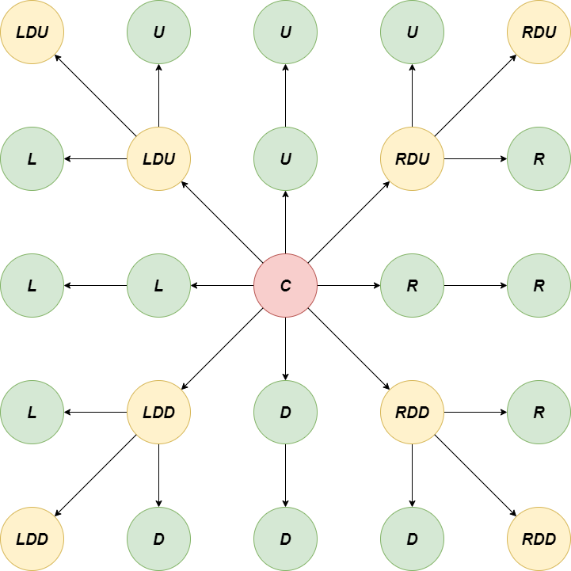
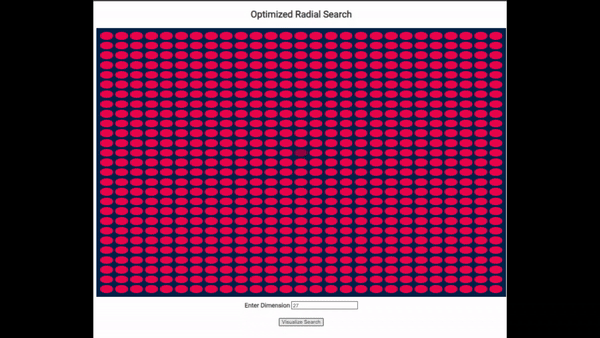

I'm# Radial-Search
An implementation to visit all indexes in a grid as a radial search to compress the visit time from O(N^2) to O(N) using asynchronous functions and finding independent path of traversal. In many systems locations are kept in grid formats to aid in easier computation and doing batch wise or logistics wise computation. Hence finding necessary resources from a radial point becomes very important and can be done by finding independent paths whithin the the Grid of dimensions [N x N] as shown below.
- - - -
### Working of Implementation

* Over here each connection away from the Centre C acts as an independent asynchronous function.
* L, R, U and D are Left, Right, Up and Down nodes respecitively and move only in the same direction of propogation.
* Example for a diagonal function is LDU is the left diagonal extending upwards and branches into another LDU, L and U function, similarly done for other diagonal nodes.
* Due to calling each function asynchronously we induce paralellism in the discovery of nodes and compute it in O(N) time complexity.
- - - -
### Implementation Output

***(Give the dimension of the grid to construct a Grid of dimensions [N x N] and it branches out visiting nodes from the centre)*** 
- - - -
#### Understandings and Scope

* Compressed it from a O(N^2) to an O(N) approach but it requires to not have too many branches as in some languages it could lead to generating too many threads.
* Requires geolocation mapping to a decently sized grid to not overload it with the asynchronous functions which may lead to memory leaks and overutilizing resources.
* Extend the usage of this algorithm to moderate sized batch wise and map a function to find solutions from the nearest visited cells.
